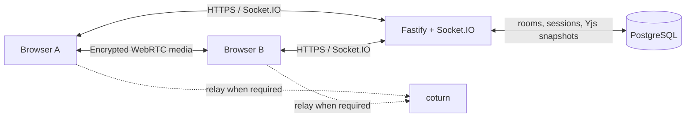

# CallYou

CallYou is a self-hosted, private, two-person video room with a shared real-time whiteboard. It is intentionally narrow: enter your name, receive a unique room link, invite one person, call, and draw together. Persian is the default UI; English is available.

## Features

- One-click, name-only rooms with readable cryptographically random links and unguessable server-issued sessions
- Exactly two active participant sessions, with an atomic PostgreSQL admission check and reconnect grace period
- Direct WebRTC audio/video with perfect negotiation, trickle ICE, ICE restart, and short-lived coturn credentials
- Yjs object-level board synchronization and durable PostgreSQL snapshots
- Pen, highlighter, eraser, line, arrow, rectangle, ellipse, text, select/move, pan, zoom, undo/redo, and host clear
- Live remote strokes and named collaborator cursors
- Responsive whiteboard-first UI, Persian RTL, English, keyboard controls, touch/stylus Pointer Events
- Structured redacted logs, readiness/liveness endpoints, strict validation, security headers, rate limits, room expiry

Non-goals include accounts, public rooms, chat, group calls, screen sharing, recording, file sharing, calendars, payments, and AI features.

## Architecture



One backend owns authentication, capacity, presence, signaling, CRDT synchronization, and cleanup. Media never enters the application server; coturn can relay encrypted WebRTC packets. The server can read whiteboard state—CallYou does **not** claim whiteboard end-to-end encryption. See [architecture](docs/architecture.md), [WebRTC](docs/webrtc.md), and [whiteboard](docs/whiteboard.md).

## Local development

Requirements: Node 22+, pnpm 10+, Docker with Compose.

```bash
cp .env.example .env
docker compose up -d postgres
pnpm install
pnpm db:migrate
pnpm dev
```

Use `http://localhost:5173`; Vite proxies API and Socket.IO to port 3000. `getUserMedia` is permitted on localhost. To test TURN locally, set a reachable `TURN_HOST`, identical application/coturn shared secrets, then run `docker compose --profile turn up -d`.

Core commands:

```bash
pnpm typecheck
pnpm lint
pnpm test
pnpm build
pnpm db:generate
pnpm db:migrate
```

## Configuration

Copy `.env.example`; never commit `.env`.

| Variable                         | Purpose                                                          |
| -------------------------------- | ---------------------------------------------------------------- |
| `APP_URL`                        | Exact allowed browser origin, `https://callyou.ir` in production |
| `DATABASE_URL`                   | PostgreSQL URL                                                   |
| `SESSION_SECRET`                 | HMAC secret, at least 32 random characters                       |
| `SESSION_HOURS`                  | Signed room session lifetime                                     |
| `ROOM_INACTIVITY_HOURS`          | Inactive room retention (default 24)                             |
| `RECONNECT_GRACE_SECONDS`        | Capacity slot grace (default 30)                                 |
| `TURN_SHARED_SECRET`             | Secret shared only by backend and coturn                         |
| `TURN_HOST`, `TURN_REALM`        | Public TURN hostname and realm                                   |
| `TURN_PUBLIC_IP`                 | VPS public IPv4/IPv6 advertised by coturn                        |
| `TURN_MIN_PORT`, `TURN_MAX_PORT` | UDP relay range                                                  |

## Production deployment

The supported target is a single Ubuntu VPS:

1. Point `A/AAAA callyou.ir` and `turn.callyou.ir` at the VPS. Remove an `AAAA` record if IPv6 is not actually routed.
2. Install Docker Engine and its Compose plugin from Docker's official Ubuntu repository.
3. Copy the repository, run `cp .env.example .env`, set `NODE_ENV=production`, `DOMAIN=callyou.ir`, `APP_URL=https://callyou.ir`, and replace every placeholder. Generate secrets with `openssl rand -base64 48`.
4. Allow `22/tcp`, `80/tcp`, `443/tcp`, `443/udp`, `3478/tcp`, `3478/udp`, and `49160:49200/udp`. Limit SSH to trusted sources where possible.
5. Run `docker compose -f docker-compose.production.yml up -d --build`. The server applies idempotent migrations before starting; Caddy obtains and renews HTTPS certificates.
6. Check `docker compose -f docker-compose.production.yml ps`, `curl -fsS https://callyou.ir/api/health`, and `/api/ready`.

Full DNS, TURN, firewall, backup, update and rollback procedures are in [deployment.md](docs/deployment.md). The production stack uses persistent volumes for PostgreSQL and Caddy state.

### Coolify

Use `docker-compose.coolify.yml` as the Docker Compose file in Coolify. Assign the public HTTPS domain to the `web` service on container port `80`; do not assign domains to `server`, `postgres`, or `coturn`. Set `APP_URL`, `TURN_HOST`, `TURN_REALM`, and `TURN_PUBLIC_IP` in Coolify. Password and secret variables prefixed with `SERVICE_` are generated and retained by Coolify.

Point both the application and TURN DNS records to the Coolify server, then allow `3478/tcp`, `3478/udp`, and `49160:49200/udp` through the host and cloud firewalls. Coolify terminates application TLS; coturn handles WebRTC relay traffic directly. See [the Coolify deployment guide](docs/deployment.md#coolify).

## Testing the product

Open a normal and private browser window. Create a room, copy the link, join in the other window, grant media access, and verify presence, drawing, text, undo isolation, refresh restoration, mute/video controls, and host end. A third isolated browser context must see “Room is full.” Test on separate networks and confirm a `relay` ICE candidate in `chrome://webrtc-internals` or Firefox `about:webrtc`. See [testing.md](docs/testing.md).

## Security and privacy

Room links act as invitations and should only be shared with the intended participant. Session, cookie, SDP and credential fields are redacted or omitted from logs. Cookies are HTTP-only, SameSite strict, and Secure in production. Every socket payload is schema-validated and bound to its authenticated room. Media is encrypted in transit by WebRTC and is never recorded. HTTPS/WSS encrypts signaling and board traffic in transit, but the server can access persisted board data. See [security.md](docs/security.md).

## Backup, restore, and upgrades

Back up with `docker compose -f docker-compose.production.yml exec -T postgres pg_dump -Fc -U "$POSTGRES_USER" "$POSTGRES_DB" > callyou.dump`. Restore into a stopped/maintenance instance using `pg_restore --clean --if-exists`. Always test restores. For upgrades, back up, save the current Git revision/image IDs, fetch the desired revision, rebuild, and watch health/logs. Roll back the Git revision or image tags and restore the database only if a migration is not backward-compatible.

## Troubleshooting and limitations

- Camera failure: confirm HTTPS, browser permissions, and that no other app owns the device.
- Socket failure: check `APP_URL`, Caddy logs, and `/socket.io` proxying.
- Calls work on LAN only: verify `TURN_PUBLIC_IP`, port 3478, UDP relay range, and matching shared secrets.
- Board load failure: check PostgreSQL readiness and snapshot-size errors in server logs.
- Audio output selection depends on browser `setSinkId` support. Mobile Safari has tighter autoplay and background-tab limits.
- Selection currently moves objects; shape resize/rotation handles are deliberately minimal. Very large boards are capped at 10,000 elements.

Important permissive dependencies include React (MIT), Fastify (MIT), Socket.IO (MIT), Yjs (MIT), Zod (MIT), and Lucide (ISC).
